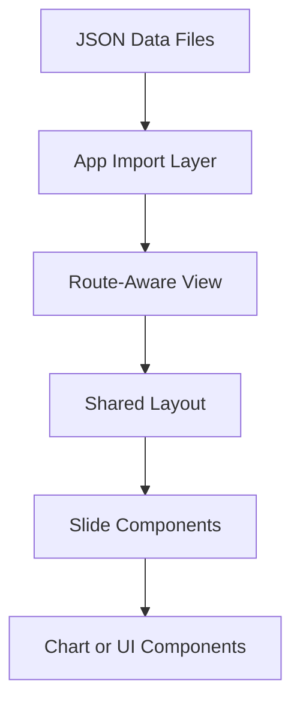
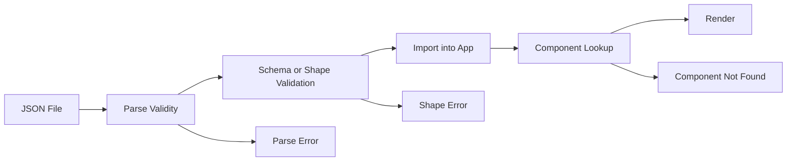
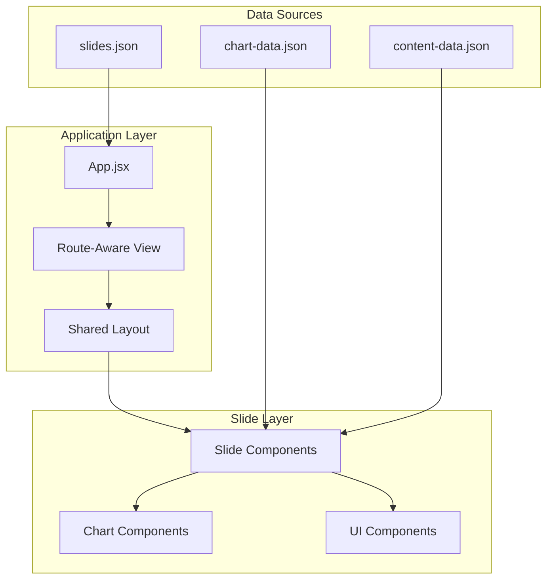

# Data Lineage Documentation

**Purpose**: Describe how configuration and content data flow through a generalized slide deck application.  
**Last Updated**: 2026-04-14

---

## Overview

This document maps how data moves through the application from source files to rendered UI.

It focuses on a common architecture where:

- slide metadata is stored in JSON
- React imports the JSON as configuration or content
- route state determines the active slide
- layout and slide components consume that data
- chart or content components render derived views

---

## Data Flow Principles

1. **Single source of truth where practical**
2. **Unidirectional flow from configuration to UI**
3. **Minimal mutation of imported content**
4. **Explicit mapping between metadata and components**
5. **Clear ownership of derived values such as current slide index**

---

## High-Level Data Flow



---

## Slide Configuration Flow

### Source to consumption path

```text
slides.json
    ↓ import
App.jsx
    ↓ extract
route-aware slide view
    ↓ select current slide and sections
shared layout
    ↓ render active slide component
slide component
```

### Typical flow

#### Step 1: Source

Primary slide configuration is stored in [`slides.json`](../src/data/slides.json).

```json
{
  "slides": [],
  "sections": []
}
```

#### Step 2: Import

The application shell imports the configuration.

```javascript
import slidesData from './data/slides.json';
```

#### Step 3: Extract

The route-aware view derives values such as:

```javascript
const totalSlides = slidesData.slides.length;
const currentSlide = slidesData.slides[currentIndex];
const sections = slidesData.sections;
```

#### Step 4: Component mapping

The app resolves the active component through a component registry.

```javascript
const SlideComponent = slideComponents[currentSlide.component];
```

#### Step 5: Render

The shared layout renders the chosen slide and passes shared props such as navigation and sections.

---

## Common Transformations

| Stage | Input | Output | Transformation |
|-------|-------|--------|----------------|
| Import | JSON file | JavaScript object | automatic JSON parsing |
| Route parsing | route parameter | numeric index | string-to-number conversion |
| Slide lookup | index | slide metadata object | array access |
| Component lookup | component name | React component | object lookup |
| Render props | metadata and handlers | component props | explicit prop passing |

---

## Route-Driven Navigation Flow

### URL to rendered slide

```text
Browser URL (/slide/5)
    ↓
React Router parameter
    ↓
current slide index
    ↓
slide metadata lookup
    ↓
component registry lookup
    ↓
rendered slide
```

### Typical implementation steps

1. route matches a path such as `/slide/:slideIndex`
2. `useParams()` returns the route value
3. the app converts the route value into an array index
4. the app selects the matching slide metadata
5. the metadata’s `component` field maps to a registered React component
6. the layout renders that component

### Example

```javascript
const { slideIndex } = useParams();
const currentIndex = (parseInt(slideIndex, 10) || 1) - 1;
const currentSlide = slidesData.slides[currentIndex];
const SlideComponent = slideComponents[currentSlide.component];
```

---

## Keyboard Navigation Flow

```text
Keyboard event
    ↓
shared navigation hook
    ↓
goToSlide(nextIndex)
    ↓
navigate(newRoute)
    ↓
route changes
    ↓
new slide renders
```

This pattern keeps navigation state derived from the URL rather than duplicated in separate component state.

---

## Supporting Data Flows

Not every slide deck uses the same supporting data, but common patterns include the following.

### Chart data flow

```text
chart-data.json
    ↓ import
slide component
    ↓ extract data and options
chart wrapper component
    ↓ render
chart library component
```

Example:

```javascript
import chartData from '@data/chart-data.json';

const { data, options } = chartData.dataset;
```

### Additional content flow

```text
content-data.json
    ↓ import
slide component
    ↓ extract content
content items or structured data
    ↓ render
layout and UI components
```

---

## Component-to-Data Dependencies

Typical dependency model:

| Component Type | Typical Data Source |
|----------------|---------------------|
| Application shell | [`slides.json`](../src/data/slides.json) |
| Shared layout | current slide, sections, navigation handlers |
| Slide component | slide-local JSON or imported content modules |
| Chart component | transformed `data` and `options` props |
| UI component | already prepared props from parent slide or layout |

---

## Validation Points

### Validation checkpoints



### Common validation stages

1. **JSON parsing**
   - ensures the file is valid JSON

2. **Data shape validation**
   - confirms expected keys and value types exist

3. **Component registration validation**
   - confirms metadata references a real component

4. **Runtime rendering validation**
   - confirms the component can render with the available props and content

---

## Data Update Procedures

### Updating slide configuration

1. edit [`slides.json`](../src/data/slides.json)
2. create or update the referenced slide component
3. register the component in the application shell
4. test route navigation and rendering
5. update documentation if structure or workflow changed

### Updating supporting content data

1. obtain updated source material
2. update the relevant JSON file while preserving structure
3. verify the data shape matches the expected component usage
4. test the slide or chart that consumes the data
5. update [data-dictionary.md](data-dictionary.md) if the schema changed

---

## End-to-End Lineage Diagram



---

## Audit Trail Guidance

For important content updates, keep a simple record of:

- file changed
- what changed
- source used
- who updated it
- when it was reviewed

Example:

```text
2026-04-14
File: chart-data.json
Change: Updated comparison values for Q2 review
Source: Internal planning dataset
Updated by: Product team
```

---

## Data Quality Metrics

Useful indicators to track:

| Metric | Target |
|--------|--------|
| JSON validity | 100% |
| Schema or shape compliance | 100% |
| Broken component references | 0 |
| Source attribution present where needed | 100% |
| Stale externally sourced data | minimized by review cadence |

---

## References

- [data-dictionary.md](data-dictionary.md)
- [main/ARCHITECTURE.md](../main/ARCHITECTURE.md)
- [adr/0004-json-slide-configuration.md](../adr/0004-json-slide-configuration.md)
- [adr/0005-component-based-architecture.md](../adr/0005-component-based-architecture.md)
- [diagrams/component-architecture.md](../diagrams/component-architecture.md)

---

**Last Updated**: 2026-04-14