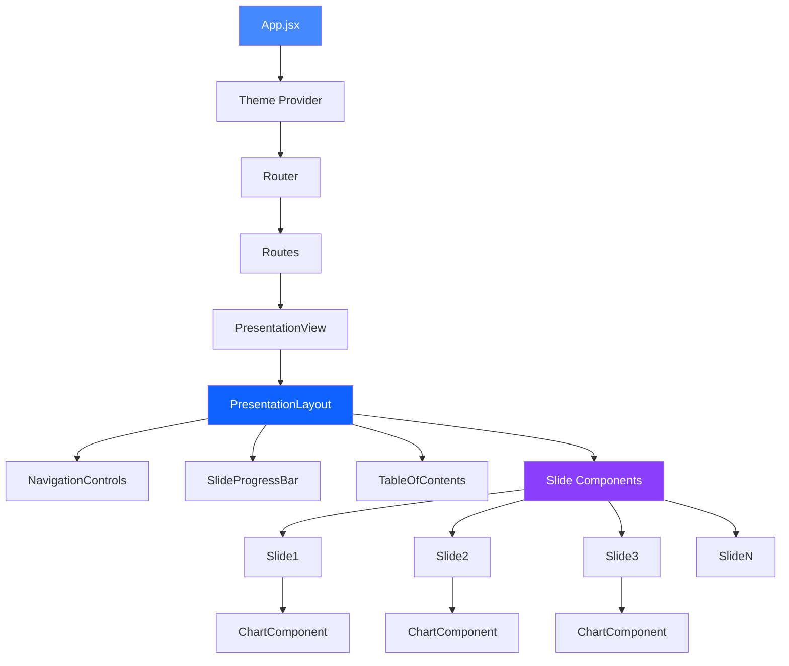
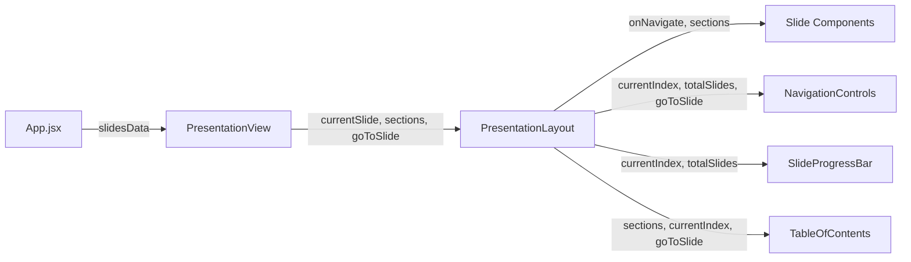

# Component Architecture Diagram

**Purpose**: Detailed view of the application's component structure and relationships.

**Last Updated**: 2026-04-14

---

## Component Hierarchy

---

## Component Categories

### 1. Application Root
- **[`App.jsx`](diagrams/component-architecture.md)**: Main application component and routing setup

### 2. Layout Components
- **[`PresentationLayout`](diagrams/component-architecture.md:17)**: Master layout wrapper
- **[`NavigationControls`](diagrams/component-architecture.md:19)**: Next and previous navigation controls
- **[`SlideProgressBar`](diagrams/component-architecture.md:20)**: Progress indicator
- **[`TableOfContents`](diagrams/component-architecture.md:21)**: Section navigation panel

### 3. Slide Components
Slide components are created based on presentation needs. Common examples include:
- Title or introduction slides
- Content slides with text and images
- Data visualization slides
- Summary or conclusion slides

### 4. Chart Components
Reusable chart components can be created for data visualization needs, such as:
- Line charts for trends
- Bar charts for comparisons
- Pie charts for distributions
- Custom visualizations as needed

---

## Component Props Flow

---

## Component Responsibilities

| Component | Responsibility | State | Props |
|-----------|---------------|-------|-------|
| [`App.jsx`](diagrams/component-architecture.md) | Routing, theme, component registry | None | None |
| [`PresentationView`](diagrams/component-architecture.md:16) | Slide management and navigation logic | currentIndex | slideIndex (from URL) |
| [`PresentationLayout`](diagrams/component-architecture.md:17) | Layout structure and prop distribution | None | currentSlide, sections, goToSlide |
| [`NavigationControls`](diagrams/component-architecture.md:19) | Navigation UI | None | currentIndex, totalSlides, goToSlide |
| [`SlideProgressBar`](diagrams/component-architecture.md:20) | Progress visualization | None | currentIndex, totalSlides |
| [`TableOfContents`](diagrams/component-architecture.md:21) | Section navigation | isOpen | sections, currentIndex, goToSlide |
| Slide components | Slide content rendering | Varies | onNavigate, sections |
| Chart components | Data visualization | None | data, options |

---

## References

- [`system-context.md`](diagrams/system-context.md)
- [`data-flow.md`](diagrams/data-flow.md)
- [`ADR-0005`](../adr/0005-component-based-architecture.md)

---

**Last Updated**: 2026-04-14  
**Version**: 1.0