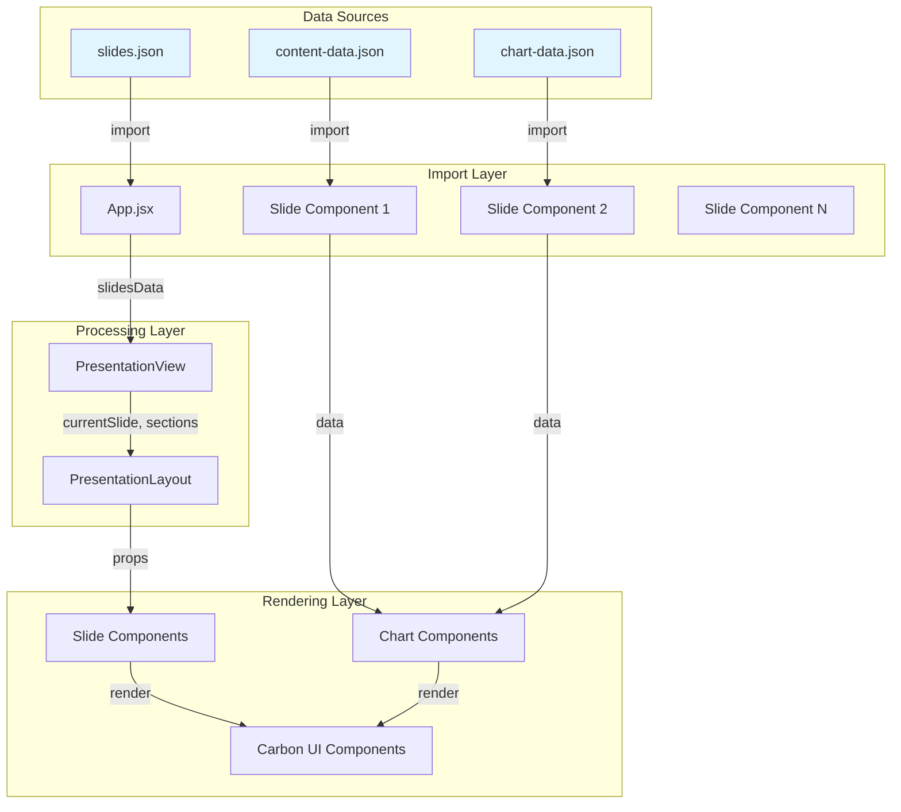
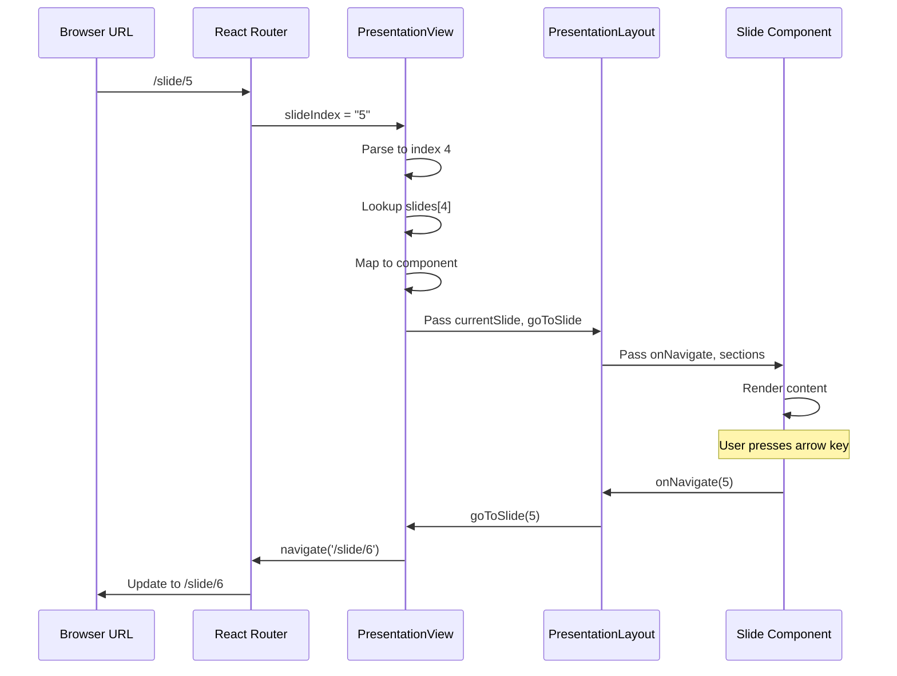
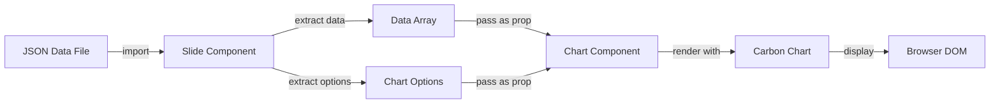
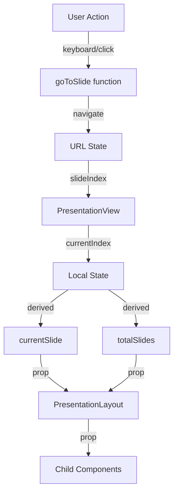

# Data Flow Diagram

**Purpose**: Visualize how data moves through the application.

**Last Updated**: 2026-04-14

---

## Complete Data Flow

---

## Navigation Data Flow

---

## Chart Data Flow

---

## State Management

---

## References

- [`data-dictionary.md`](../data/data-dictionary.md)
- [`data-lineage.md`](../data/data-lineage.md)
- [`system-context.md`](./system-context.md)

---

**Last Updated**: 2026-04-14  
**Version**: 1.0