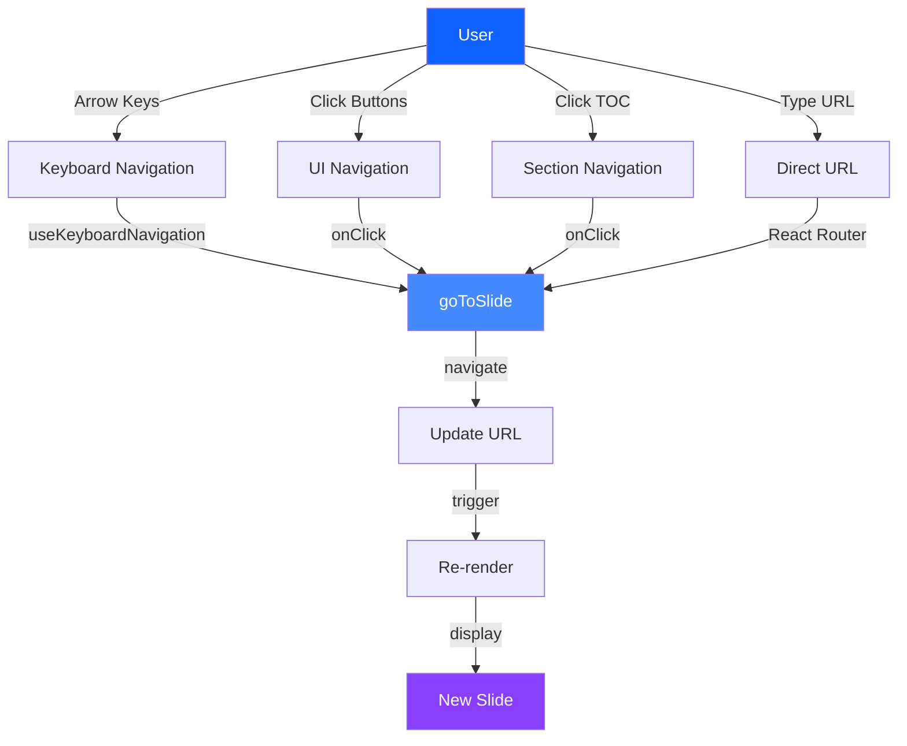
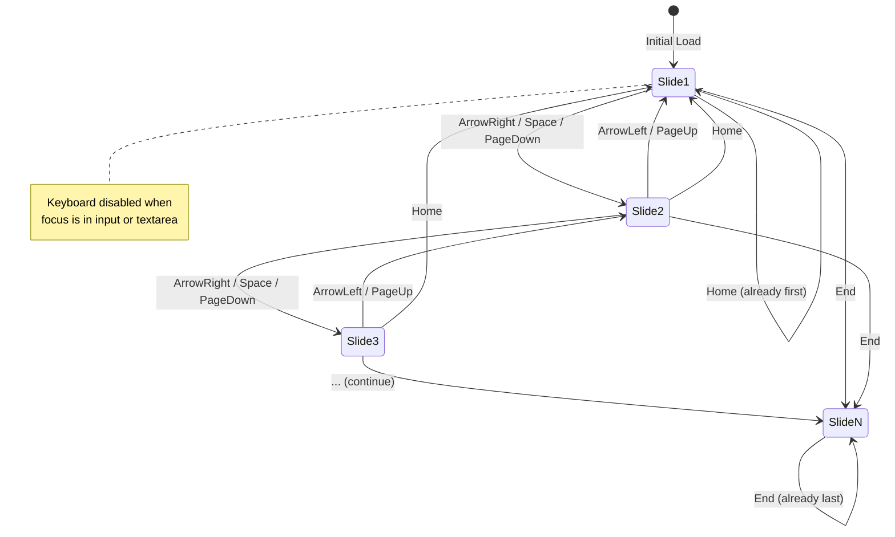
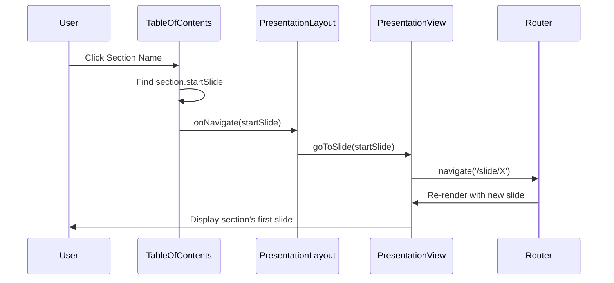
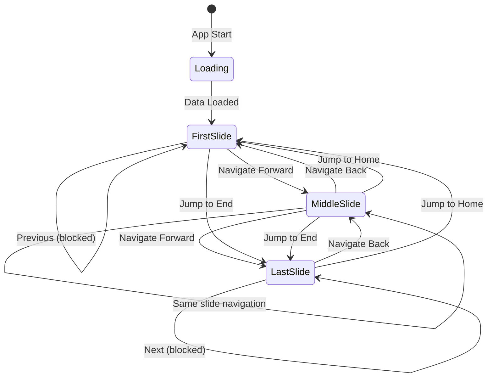
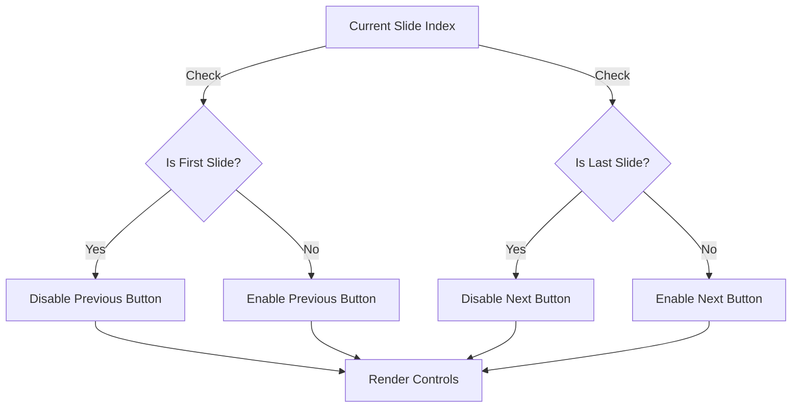
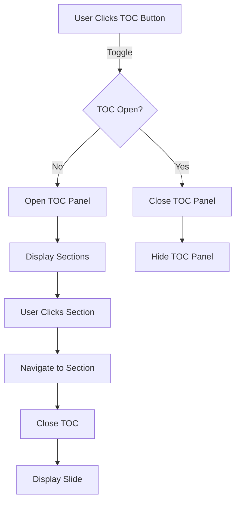
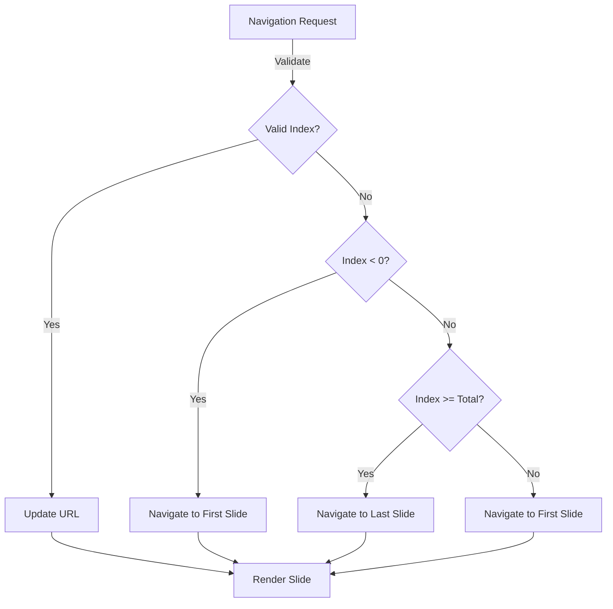
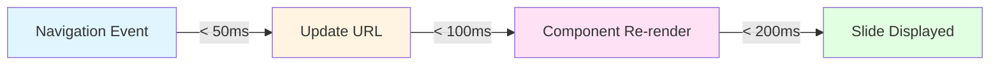

# Navigation Flow Diagram

**Purpose**: Visualize navigation patterns and user interactions.

**Last Updated**: 2026-04-14

---

## Navigation Methods



---

## Keyboard Navigation Flow



---

## URL-Based Navigation

```mermaid
graph LR
    A[URL: /slide/1] -->|Route Match| B[PresentationView]
    B -->|Parse| C[slideIndex = 1]
    C -->|Convert| D[currentIndex = 0]
    D -->|Lookup| E[slides[0]]
    E -->|Map| F[First Slide Component]
    F -->|Render| G[Display]
    
    H[Invalid URL: /slide/999] -->|Route Match| B
    B -->|Parse| I[slideIndex = 999]
    I -->|Validate| J[Out of bounds]
    J -->|Redirect| K[/slide/1]
```

---

## Section Navigation



---

## Navigation State Machine



---

## Navigation Controls State



---

## Table of Contents Interaction



---

## Navigation Error Handling



---

## Keyboard Shortcuts Reference

| Key | Action | Condition |
|-----|--------|-----------|
| `ArrowRight` | Next slide | Not last slide |
| `ArrowLeft` | Previous slide | Not first slide |
| `Space` | Next slide | Not last slide |
| `PageDown` | Next slide | Not last slide |
| `PageUp` | Previous slide | Not first slide |
| `Home` | First slide | Always |
| `End` | Last slide | Always |

**Disabled When**: Focus is in `input` or `textarea` elements

---

## Navigation Performance



---

## References

- [`system-context.md`](./system-context.md)
- [`component-architecture.md`](./component-architecture.md)
- [`ADR-0001`](../adr/0001-use-react-router.md)

---

**Last Updated**: 2026-04-14  
**Version**: 1.0