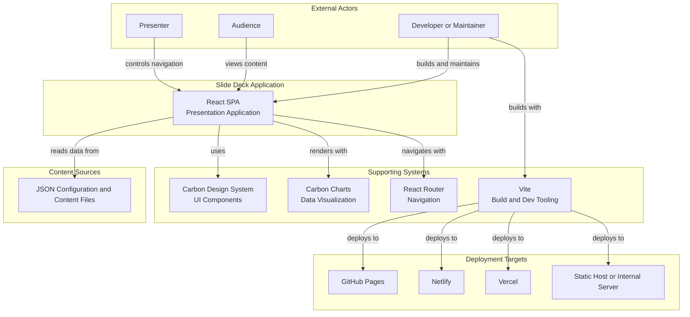
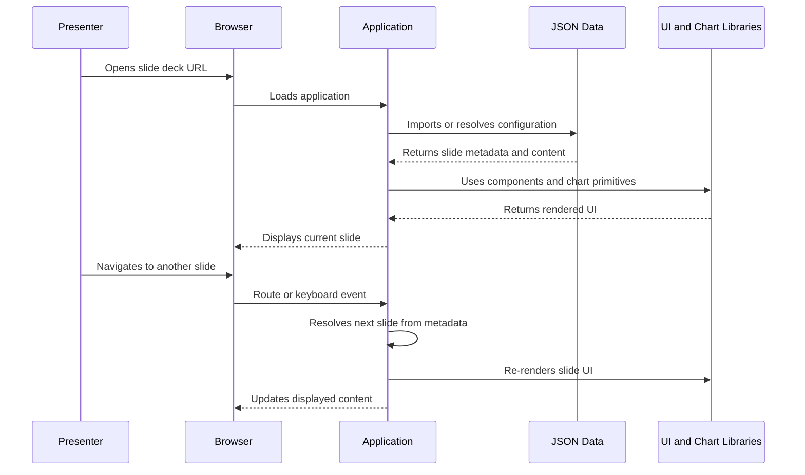
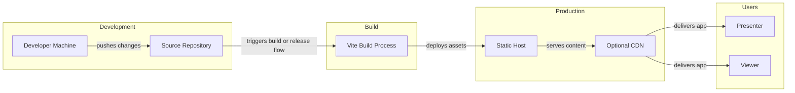
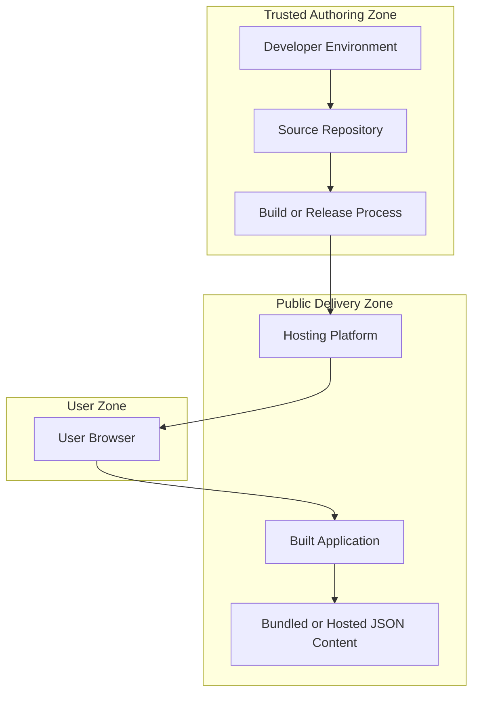

# System Context Diagram

**Purpose**: High-level view of a generalized web-based slide deck system and its external interactions.  
**Last Updated**: 2026-04-14

---

## System Context

This diagram shows the slide deck application in its operational context, including users, supporting systems, and deployment targets.

---

## System Boundary

### Inside the system

Core application elements commonly include:

- React-based single-page application
- slide components
- shared presentation layout
- navigation controls and keyboard shortcuts
- optional chart and visualization components
- JSON-based configuration and content loading

### Outside the system

Supporting external elements commonly include:

- Node.js and npm during development
- Vite for local development and builds
- static hosting platforms
- browsers used by presenters and viewers
- external research or content sources used to prepare JSON data

---

## User Interactions

### Presenter

Typical actions:

- launch the slide deck in a browser
- navigate with keyboard or UI controls
- move between sections
- present content to an audience

Typical goals:

- maintain smooth presentation flow
- access the intended slide quickly
- keep the interface predictable during delivery

### Audience

Typical actions:

- view slide content
- follow transitions and narrative flow
- interpret charts or structured content

Typical goals:

- understand the message clearly
- follow slide progression easily
- view readable, stable presentation content

### Developer or Maintainer

Typical actions:

- update slide components
- modify configuration or content data
- adjust layout or navigation behavior
- troubleshoot issues
- deploy updates

Typical goals:

- maintain reliability
- keep content and docs aligned
- minimize regressions
- support future changes cleanly

---

## External Dependencies

### Carbon Design System

**Purpose**: UI component system, design tokens, and theming.

Common interactions:

- application imports Carbon React components
- shared layout uses Carbon structure and controls
- SCSS and tokens align spacing, color, and typography

### Carbon Charts

**Purpose**: Chart rendering for slide-based visualizations.

Common interactions:

- slides pass chart-friendly data and options
- charts render inside layout regions defined by the deck

### React Router

**Purpose**: Route-based navigation.

Common interactions:

- each slide can be accessed by URL
- browser history supports navigation
- route state determines the active slide

### Vite

**Purpose**: Development server and build tool.

Common interactions:

- runs local development server
- bundles production assets
- handles alias and SCSS configuration

---

## Data Flow Summary

---

## Deployment Context

---

## System Characteristics

### Technical characteristics

| Characteristic | Value |
|----------------|-------|
| Application type | Single Page Application |
| Architecture style | Component-based React application |
| Deployment model | Static hosting |
| Data storage | JSON files or bundled content |
| Navigation model | URL-based routing |
| Styling model | Carbon plus SCSS |

### Operational characteristics

| Characteristic | Typical Expectation |
|----------------|---------------------|
| Availability | determined by hosting platform |
| Performance | fast enough for live presentation use |
| Scalability | strong for static content delivery |
| Security | typically HTTPS plus secure hosting configuration |
| Maintenance | low to moderate depending on content churn |

---

## Security Boundaries

---

## Constraints and Assumptions

### Constraints

1. modern browser support is assumed
2. JavaScript must be enabled
3. route handling must work with the chosen host
4. the deck is optimized primarily for desktop or presentation contexts
5. content changes typically require rebuild and redeploy unless a dynamic content layer is added

### Assumptions

1. a presenter or viewer uses a modern browser
2. the team maintains JSON content and React components together
3. slide navigation is derived from routes or shared handlers
4. deployment is to static infrastructure or another SPA-friendly host

---

## Future Considerations

Potential future additions might include:

- analytics
- CMS-backed content
- authentication
- dynamic data sources
- collaborative editing or multi-presenter flows

---

## References

- [component-architecture.md](component-architecture.md)
- [data-flow.md](data-flow.md)
- [navigation-flow.md](navigation-flow.md)
- [main/ARCHITECTURE.md](../main/ARCHITECTURE.md)
- [adr/0001-use-react-router.md](../adr/0001-use-react-router.md)
- [adr/0002-carbon-design-system.md](../adr/0002-carbon-design-system.md)
- [adr/0003-vite-build-tool.md](../adr/0003-vite-build-tool.md)

---

**Last Updated**: 2026-04-14